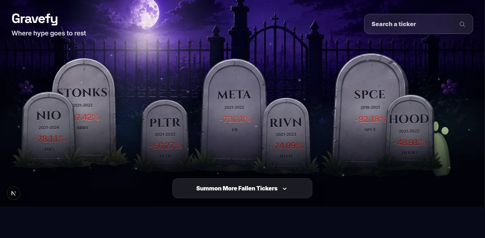

# Gravefy 🪦

A spooky little graveyard for tickers that got buried after their all-time highs.



## What it does 👻

Search for a stock/ETF ticker and Gravefy shows:

- current price
- all-time high price
- drawdown from ATH
- recovery needed to reach ATH again
- a haunted tombstone because portfolios deserve drama

> Educational only. Not financial advice.

## Data sources 📊

- **Wallbit API**: live ticker/asset data and search results  
  https://developer.wallbit.io/
- **Stooq**: historical daily prices used to calculate ATH data  
  https://stooq.com
- **Local fallback data**: used for the default graveyard preview and when live data is unavailable

## How it works ⚙️

1. Type a ticker in the search box.
2. The app looks up live asset data from Wallbit.
3. It fetches historical prices from Stooq.
4. It calculates how far the ticker is from its ATH.
5. The result gets rendered as a tombstone.

## Run locally 🚀

```bash
npm install
npm run dev
```

Open:

```txt
http://localhost:3000
```

## Environment variables 🔐

Copy `.env.example` to `.env.local`:

```bash
cp .env.example .env.local
```

Then set:

```env
WALLBIT_BASE_URL=https://api.wallbit.io
WALLBIT_API_KEY=your_api_key_here
```

Without a Wallbit key, the app still shows the local preview tickers.
